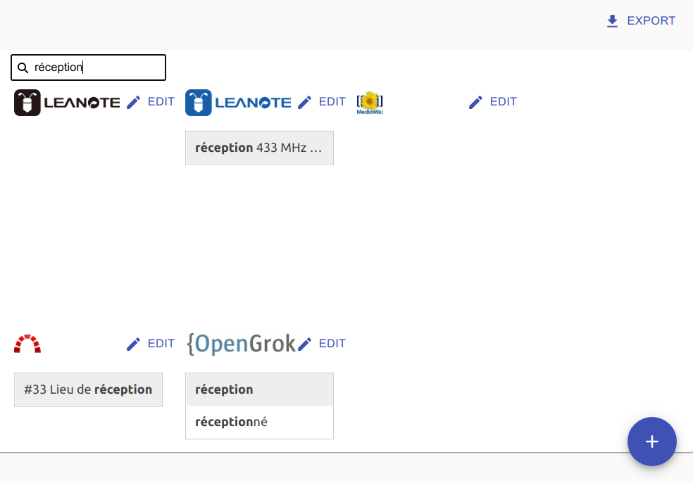

# Mega XXL autocomplete

Dashboard to search accross several endpoint. Replacement for [Heimdall](https://heimdall.site) or [Organizer](https://github.com/causefx/Organizr).


<a href="https://github.com/PascalNoisette/mega-xxl-autocomplete/actions">
  
</a>




Features :
- Dashboard of bookmarks
- Search via autocomplete several endpoints
- Configurable, Responsive
- Credential storage is encrypted

Any services can be bookmarked and in addition search is supported for :
- [nextcloud](https://nextcloud.com/)
- [mediawiki](https://www.mediawiki.org/)
- [opengrok](https://oracle.github.io/opengrok/)
- [redmine](https://www.redmine.org/)
- the [firebird](https://www.firebirdsql.org/) data of [V V V](http://vvvapp.sourceforge.net/)
- any opensearch endpoints ([almost any](https://github.com/eoxc/opensearch/issues/16))
- and any elasticsearch endpoints

## Run with docker

```docker run --rm -p3000:3000 -v `pwd`/data/:/app/data netpascal0123/mega-xxl-autocomplete:4.0```

```docker-compose.yml 
version: '2'
services:
  autocomplete:
    image: netpascal0123/mega-xxl-autocomplete:3.1
    restart: unless-stopped
    volumes:
      - ./data:/app/data/
    ports:
      - 3000:3000
```

NB : first time password can be anything

## Run from sources

This project was bootstrapped with :
- [Next.js](https://nextjs.org/)
- [Reactive Search](https://docs.appbase.io/docs/reactivesearch/v3/overview/quickstart/)
- [React Admin](https://marmelab.com/react-admin/Readme.html)
- [Api Dev Tools](https://apitools.dev/openapi-schemas/)

### `npm install`

Software dependancies are managed with npm.

### `npm run build`

Builds the frontend app for production to the `build` folder.

### `npm run start`

Serve frontend and backend at [http://localhost:3000](http://localhost:3000) 

### `npm run dev`

Same but for developement.

