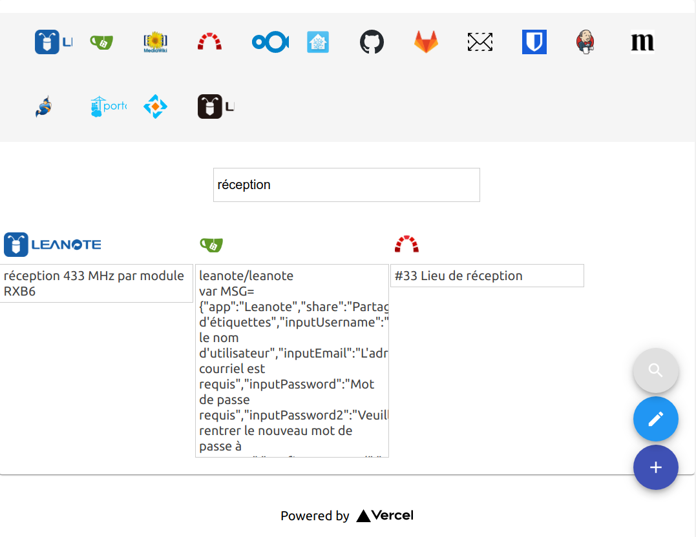

# Mega XXL autocomplete

Dashboard to search accross several endpoint.



Features :
- Autocomplete
- Configurable endpoints
- Support for Elasticsearch, mediawiki, opengrok and redmine endpoints
- Credential storage is encrypted

## Run with docker

```docker run --rm -p8000:8000 -v `pwd`/data/:/app/data netpascal0123/mega-xxl-autocomplete:1.0```

```docker-compose.yml 
version: '2'
services:
  autocomplete:
    image: netpascal0123/mega-xxl-autocomplete:1.0
    restart: unless-stopped
    volumes:
      - ./data:/app/data/
    ports:
      - 8000:8000
```

## Run from sources

This project was bootstrapped with :
- [Create React App](https://github.com/facebook/create-react-app).
- [Reactive Search](https://docs.appbase.io/docs/reactivesearch/v3/overview/quickstart/)
- [React Admin](https://marmelab.com/react-admin/Readme.html)
- [Api Dev Tools](https://apitools.dev/openapi-schemas/)

### `npm install`

Software dependancies are managed with npm.

### `yarn build`

Builds the frontend app for production to the `build` folder.

### `node index.js`

Serve frontend and backend.
